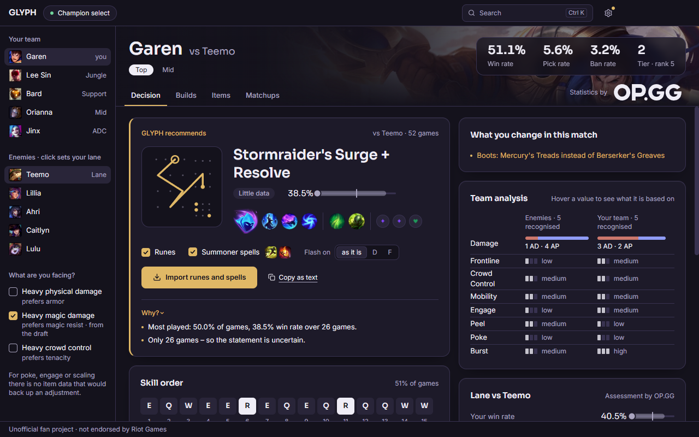
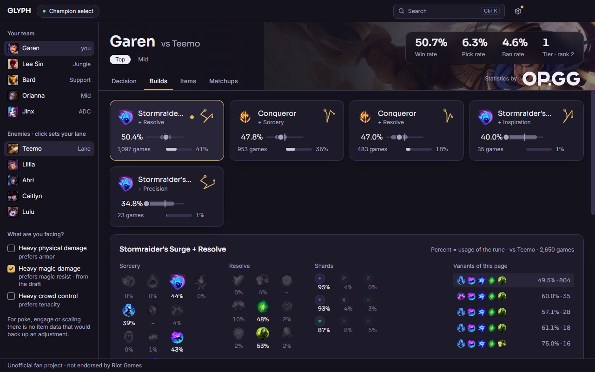
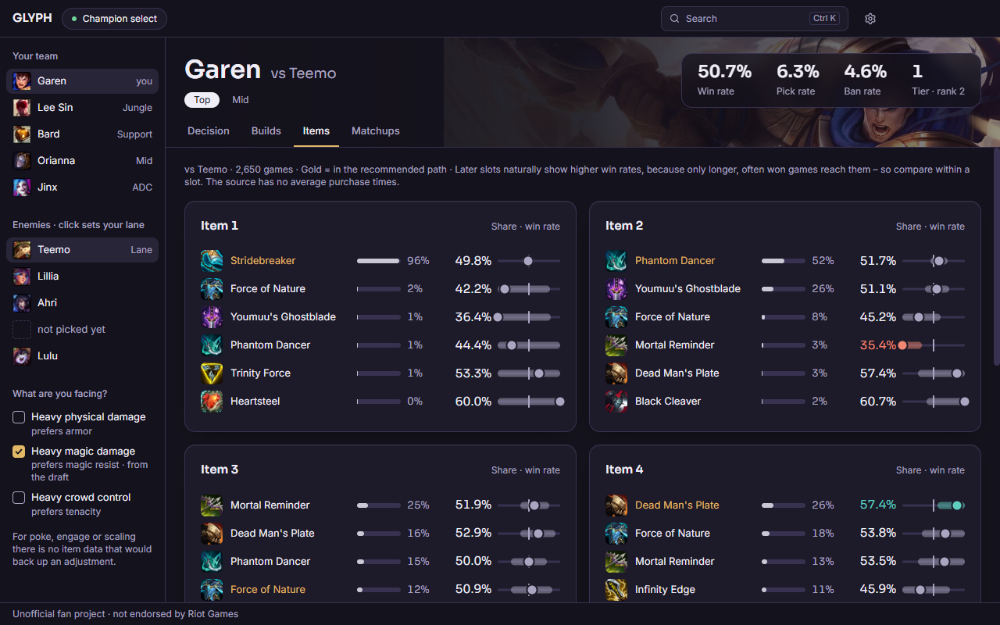
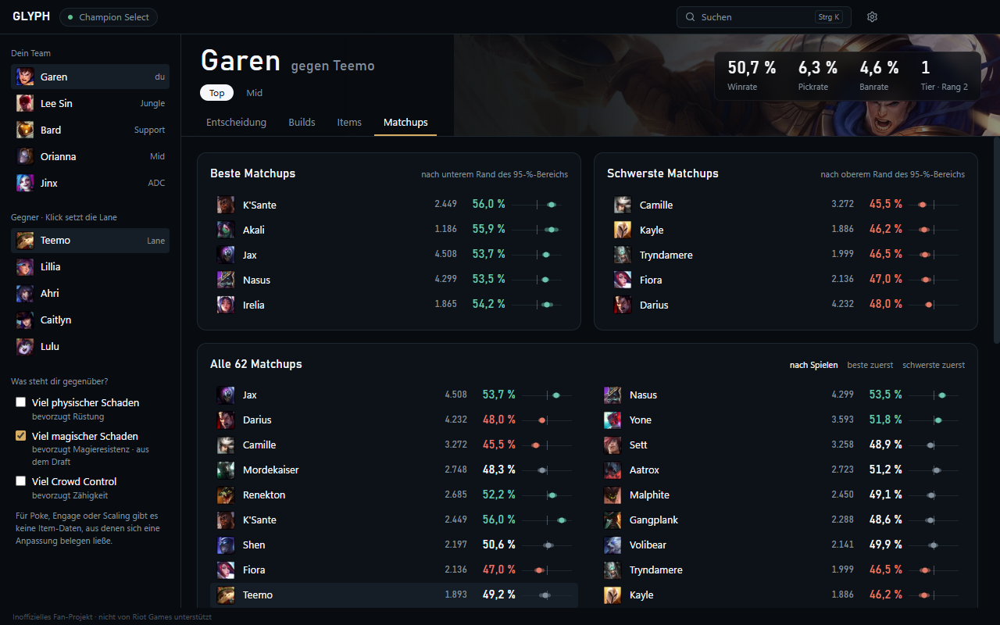

# Glyph

**What should I play, what should I build, and why? Answers for champion select, each with its numbers.**

Glyph is a small Windows app for League of Legends. It notices your champion select, reads both teams and shows which
runes and items to take in exactly this game. Every recommendation says what it rests on, and every win rate is drawn
together with its 95 % range instead of an invented “confidence” score. One click imports the runes and summoner spells into the client.
Glyph speaks **German** and **English** (switch under the gear icon); champion, item and rune names are always English.

> **Unofficial fan project.** Glyph isn't endorsed by Riot Games and doesn't reflect the views or opinions of Riot Games
> or anyone officially involved in producing or managing Riot Games properties. Riot Games and all associated properties
> are trademarks or registered trademarks of Riot Games, Inc. Glyph is not affiliated with OP.GG either.



## What Glyph does

- **Decision:** the recommended rune page, item path, boots and skill order for your lane opponent, with a “Why?”
  (why) under each pick. *What you change in this match* lists every deviation from the usual build.
- **Draft:** both teams, the lane opponent picked out automatically, and a side-by-side team comparison (damage type,
  frontline, crowd control, engage, peel, poke, burst).
- **Builds:** one card per rune page with win rate, games and pick rate, the full rune tree with the usage of every
  rune, and how each build does against each opponent.
- **Items:** the options for every purchase slot with share and win rate, boots, starting items and the most common
  three-item combinations. Click any item or rune for details.
- **Matchups:** best, hardest and all matchups; a click switches the whole analysis to that opponent.
- **Search** (Ctrl K): a champion, “Bard vs Brand”, an item, a rune or a build.
- **Import** of runes, summoner spells or both into the League client, without touching your other rune pages. You
  choose what is imported and which key Flash goes on.

| Builds | Items |
|---|---|
|  |  |



## Install

Download `Glyph-Setup.exe` from the [releases](../../releases) and run it – no admin rights needed. Start League, enter
a champion select, done. Without League running you can open any champion through the search.

The installer isn't signed, so Windows may show “Windows protected your PC” on the first start: click *More info* →
*Run anyway*.

## FAQ

**Windows or my antivirus blocks the installer. Is it a virus?**
No. The installer isn't signed with a paid code-signing certificate and isn't downloaded often, so Windows SmartScreen
doesn't know it. Everything Glyph does is in this repository, and the installer is built from it. To check that your
download wasn't tampered with, compare its checksum with the one in the release notes:
`Get-FileHash .\Glyph-Setup.exe` in PowerShell.

**Can I get banned for using it?**
Glyph only reads the champion select and, when you click import, writes a rune page and your two summoner spells
through the League client's own local interface, the same way other importers do. It does nothing during a game, picks
or bans nothing and never touches the game itself.
There is no guarantee from Riot for any third-party tool, though – you use it at your own risk.

**Where do the numbers come from?**
See [Data](#data). Statistics are fetched when you open a champion and kept for 24 hours, so Glyph needs an internet
connection.

**Why does it say “not provided by the source” in some places?**
Because Glyph doesn't make numbers up. Item purchase times, early/mid/late ratings per build and per-phase matchup data
aren't in the statistics it uses, so it says so instead of guessing.

**Why does a champion take a few seconds the first time?**
Each request to the statistics source takes three to five seconds, and Glyph can't change that. It keeps the number
small instead: without a lane opponent it first shows the champion's overall build (one request), with an opponent that
matchup (one request). Only the *Builds* and *Items* tabs, or a ticked situation, load the detailed data from the six
most played matchups. Everything is cached, so a champion you have opened before appears at once.

**It doesn't find my League client.**
Start League first and wait until you're logged in. Glyph looks for the client's lockfile in the folder the Riot Client
installed it to, and falls back to the running process.

**How do I update?**
Download the new `Glyph-Setup.exe` and run it – it installs over the old version.

**Does it run on Mac or Linux?**
No, Windows 10/11 (64-bit) only.

## Data

| Source | Used for | Fetched |
|---|---|---|
| [OP.GG](https://github.com/opgginc/opgg-mcp), public MCP endpoint | win/pick/ban rate, tier, rune pages, items per slot, matchups, game length, lane verdict | on demand, cached for 24 h |
| [Data Dragon](https://developer.riotgames.com/docs/lol#data-dragon) (Riot) | champions, items with their properties, runes, pictures | `data/static.json`, per patch |
| [Meraki Analytics](https://github.com/meraki-analytics/lolstaticdata) | Riot's champion classes, 1–3 ratings, damage type, positions | `data/static.json`, per patch |

OP.GG allows Glyph to use its data as long as the OP.GG logo and a link to [op.gg](https://op.gg) are shown wherever
that data appears – Glyph shows both in the header of every champion view. OP.GG may restrict access depending on request
volume and can ask for the use to stop at any time.

How a recommendation is made:

- **Runes:** among the pages with at least 30 games, the one whose 95 % range has the highest lower end. “Clear
  favourite” means its whole range lies above the next page's.
- **Items:** the most bought item per slot. If the enemy team is heavy on physical damage, magic damage or crowd control
  (taken from the draft, or ticked by hand), at most one item and the boots are swapped per flag – only for an option
  with the matching property that is bought in at least 10 % of games and doesn't do clearly worse.
- **Team comparison:** the average of Riot's ratings and the number of champions of certain classes.

## Build it yourself

Requirements: Windows, Node.js 22 or newer.

```
npm install
npm run dev          # development with hot reload
npm run dist         # dist/Glyph-Setup.exe, prints its SHA-256
npm run update-data  # refresh data/static.json for a new patch
npm run icon         # redraw build/icon.png
npm run check-i18n   # every interface text has an English entry
```

The code is split into four layers: data (`src/main/data`, `src/main/league`), analysis (`src/shared/analysis.ts`),
recommendation (`src/shared/recommend.ts`) and the interface (`src/renderer`), which only displays.

## License

Glyph is free software under the **GNU General Public License v3.0** – see [LICENSE](LICENSE).

Champion, item and rune pictures are loaded from Riot's Data Dragon and belong to Riot Games; they are not part of this
repository, except in the screenshots above.

## Support

Glyph is and stays free, with no paid features. If you like it, you can support its development with a coffee –
voluntary, nothing in return: **[ko-fi.com/krogger](https://ko-fi.com/krogger)** ☕
